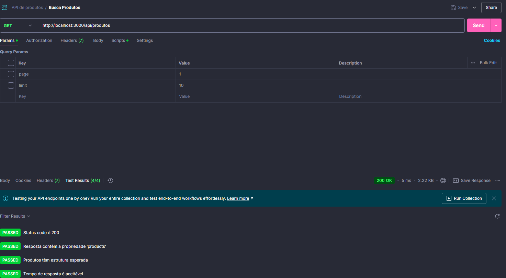
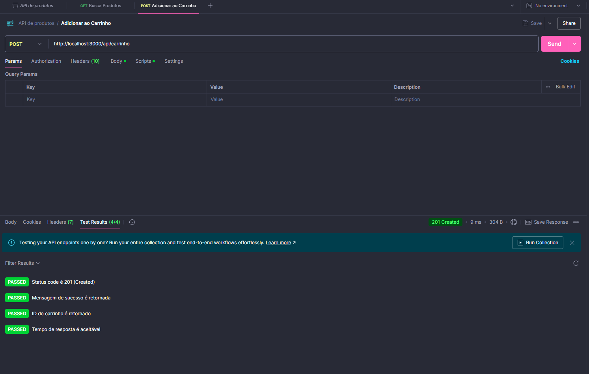
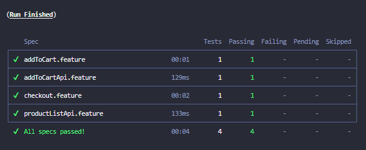
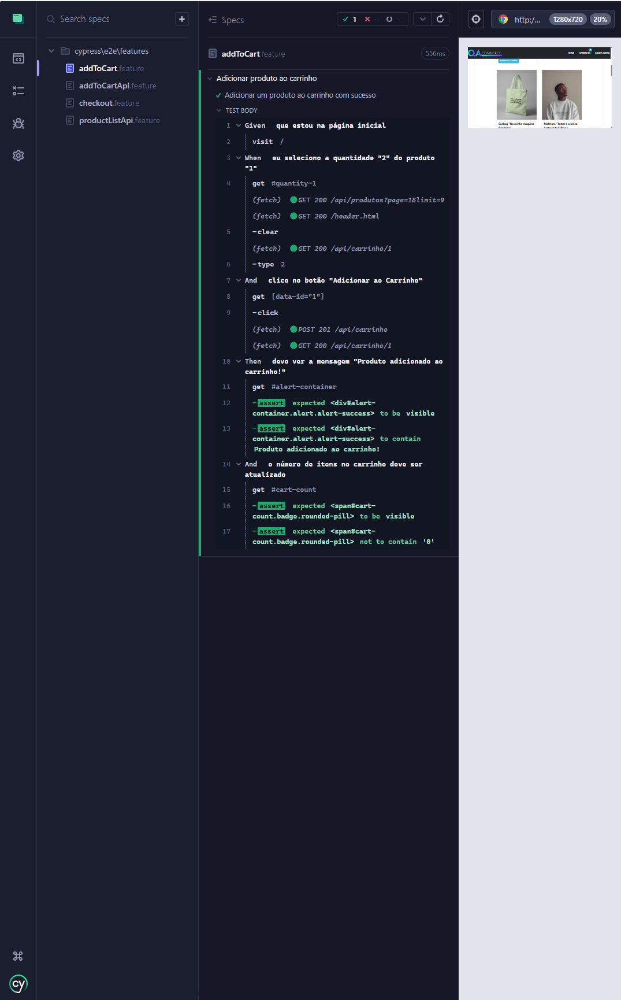
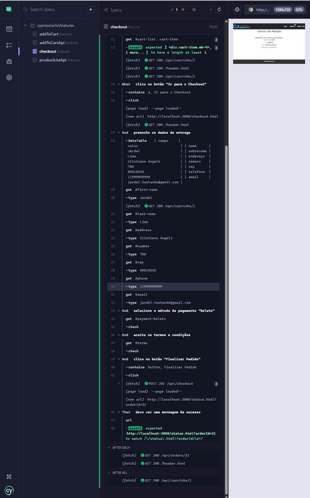
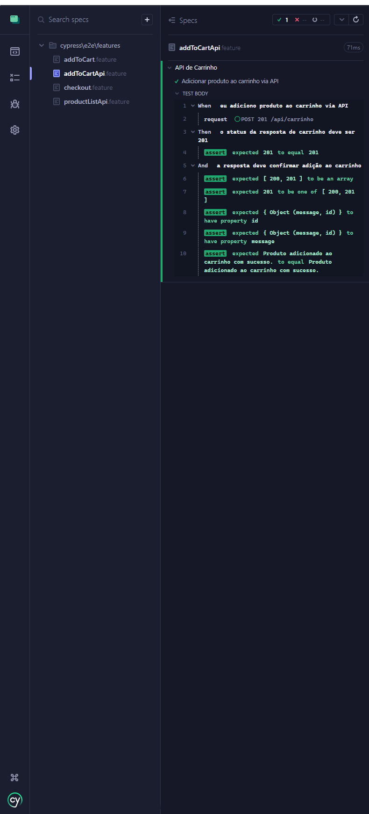
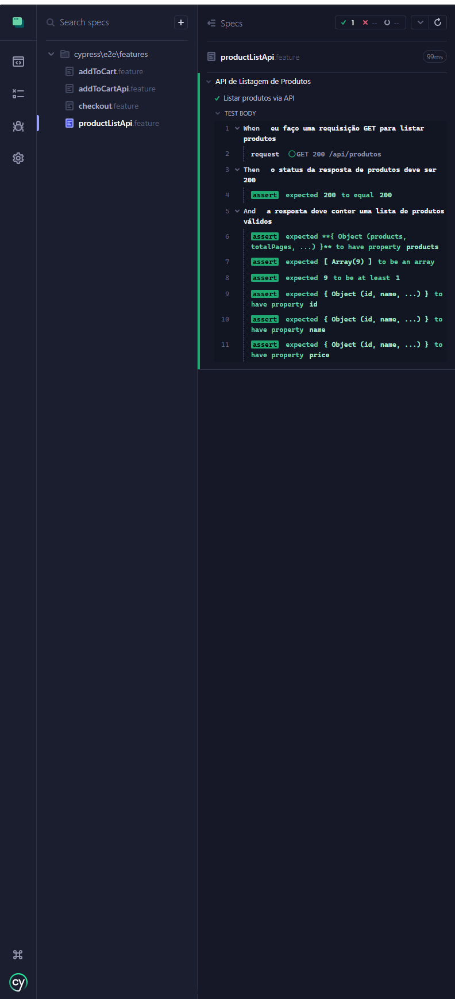

# QA-Commerce - Teste técnico para Keeggo

Este projeto implementa testes automatizados para a aplicação QA-Commerce, focando em:
1. **Criação de cenários**
   - Adicionar Produto ao Carrinho
   - Checkout Simples
   - Validação de Campos Obrigatórios (Ficará na pasta scenarios pois não foi automatizado.)
2. **Testes no front:**
   - Adicionar Produto ao Carrinho
   - Checkout Simples
2. **Testes no back:**
   - GET /api/produtos - Listar produtos
   - POST /api/carrinho - Adicionar produto ao carrinho

## Pré-requisitos

- Node.js (v14 ou superior)
- NPM (v6 ou superior)
- Cypress (14.3.2)

## Instalação

1. Clone ou faça um fork do repositório:
   ```
   git clone https://github.com/seu-usuario/qa-commerce-tests.git
   ```

2. Entre no diretório do projeto:
   ```
   cd qa-commerce-tests
   ```

3. Instale as dependências:
   ```
   npm install
   ```

4. Inicie a aplicação QA-Commerce:
   ```
   cd qa-commerce
   npm install
   npm start
   ```
5. Instalar Cypress e Cucumber:
   ```
   npm install cypress --save-dev
   npm install --save-dev @badeball/cypress-cucumber-preprocessor @bahmutov/cypress-esbuild-preprocessor esbuild
   ```

6. Em outro terminal, execute o Cypress:
   ```
   npx cypress open
   ```

## Estrutura do Projeto

```
cypress/
├── e2e/
│   ├── features/
│   │   └── scenarios/
│   │   |       └── campos_obrigatorios.feature # Cenário Cucumber para parte 1 do teste (não automatizado)
│   │   ├── addToCart.feature # Cenário Cucumber para adicionar produto ao carrinho
│   │   ├── addToCartApi.feature # Cenário Cucumber para teste de api trazendo listagem de produtos (GET)
│   │   ├── checkout.feature # Cenário Cucumber para validar fluxo do checkout
│   │   └── productListApi.feature # Cenário Cucumber para teste de api adicionar produto ao carrinho (POST)
│   └── fixtures/
│       └── example.json # Dados de teste
├── pages/
│   ├── CartPage.js # Page object da página inicial
│   ├── CheckoutPage.js # Page object da página do carrinho
│   └── HomePage.js # Page object da página de checkout
└── support/
    ├── step_definitions/
    │   ├── AddToCart.js # Steps para adicionar produto ao carrino
    │   ├── AddToCartApi.js # Steps para adicionar produto no carrinho via api
    │   ├── checkout.js # Steps para validar fluxo de checkout
    │   ├── productListApi.js # Steps para trazer listagem de produtos via api
    │   └── commands.js # Comandos personalizados
    └── e2e.js # Configurações globais
```

## Executando os Testes

### Todos os testes
Para abrir o Cypress e executar todos os testes:
```
npm run cypress:run (Headless)
npx cypress open (UI)
```

### Apenas testes UI
Para executar somente os testes de UI:
```

npx cypress run --spec "cypress/e2e/features/addToCart.feature"
npx cypress run --spec "cypress/e2e/features/checkout.feature"
```

### Apenas testes de API
Antes de executar os testes de API fiz
a validação dos endpoints pelo Postman:



```
Para executar os testes de API via Cucumber:
```
npx cypress run --spec "cypress/e2e/features/productListApi.feature"
npx cypress run --spec "cypress/e2e/features/addToCartApi.feature"
```

## Cenários Implementados

### Testes UI
1. **Adicionar produto ao carrinho**
   - Adicionar um produto ao carrinho com sucesso

2. **Checkout Simples**
   - Concluir checkout com todos os campos obrigatórios preenchidos

### Testes de API
1. **Listar produtos**
   - Validar resposta da API de listagem de produtos
   - Verificar status code 200
   - Verificar estrutura da resposta

2. **Adicionar produto ao carrinho**
   - Validar a adição de produto ao carrinho via API
   - Verificar status code 201
   - Verificar confirmação de produto adicionado

## Abordagem de Automação

Este projeto utiliza uma combinação de abordagens para garantir uma cobertura eficiente dos testes:

1. **Page Objects + Cucumber (BDD) para testes de UI:**
   - Utiliza Page Objects para encapsular a lógica de interação com a interface
   - Implementa cenários em Gherkin para facilitar a leitura por stakeholders não técnicos
   - Separa a lógica de interação da lógica de negócio

2. **Request diretas para testes de API:**
   - Validação de endpoints críticos (GET e POST)
   - Verificação de status codes
   - Validação de estrutura de resposta
   - Implementado tanto com Cucumber quanto com abordagem direta

## Evidencia dos testes passando







## Conclusão

Esta implementação atende aos requisitos da prova técnica, criando 3 cenários de testes, automatizando dois fluxos principais da UI (Adicionar ao Carrinho e Checkout) e dois endpoints de API (GET e POST).

A estrutura foi desenvolvida seguindo boas práticas de automação, com foco em organização, estrutura. cobertura e detalhes conforme solicitado nos critérios de avaliação.